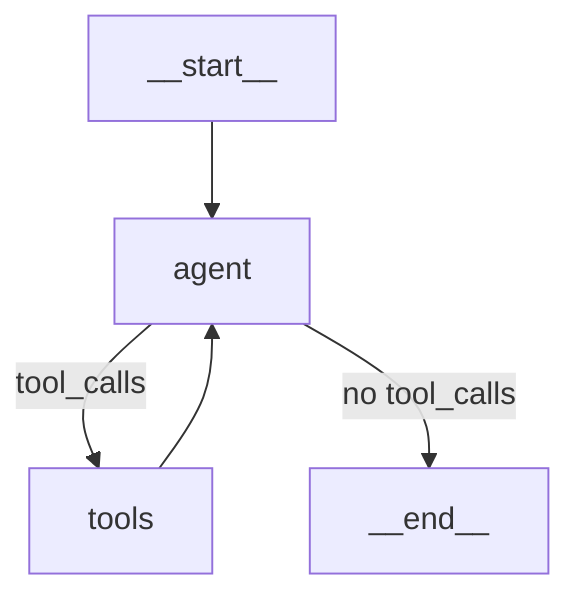

# 1. `create_agent(...)` 创建 `graph`


> `create_agent` 是 `LangChain/LangGraph` 的**高层封装**，它把 `model + tools + middleware + state_schema + checkpointer` 编织成一张**标准的 ReAct 图**。  
> 流程本质是：**`before_agent` 中间件 → agent 节点（LLM 决策）→ 工具节点 → 回到 agent → `after_agent` 中间件 → END**。

下面按「图的骨架 → 每个参数注入什么 → 中间件如何改变流程 → 完整时序」四层拆解。

---

## 1.1. `create_agent` 的标准图骨架

`create_agent`（`LangChain v1` 风格）内部构造的图大致是：

```
                    create_agent(...)
                          │
        ┌─────────────────┼─────────────────┐
        │                 │                 │
     model             tools           middleware
        │                 │                 │
        │                 │        ┌────────┴────────┐
        │                 │        │                 │
        │                 │   before_agent      after_agent
        │                 │        │                 │
        ▼                 ▼        ▼                 ▼
     ┌──────────────────────────────────────────────────┐
     │                    graph                         │
     │                                                  │
     │  START → [before_agent]  → agent ───┐            │
     │                              ↑      │            │
     │                              │  tool_calls?      │
     │                              │      │            │
     │                              │      ▼            │
     │                              └── run_tools       │
     │                                     │            │
     │                                     ▼            │
     │                               [after_agent]  →  END
     └──────────────────────────────────────────────────┘
                          │
                          ▼
              final_state / StreamEvent
```

关键点：

1. **agent 节点和 tools 节点之间是一个循环**：  
   有 `tool_calls` → 进 tools → 回 agent；没 `tool_calls` → 进 after_agent。
2. **`before_agent` / `after_agent` 是中间件的钩子**，不是独立节点，而是**包在 agent 节点前后**。
3. **`recursion_limit`** 控制这个循环最多跑多少次（`max_loop_steps * graph_node_multiplier`）。

---

## 1.2. 传入参数

### 1. `model=model`

决定 **agent 节点用哪个 LLM**。  
这里是路由后的 `researcher_model`，可能是 `FallbackChatModel`（多 provider 兜底）。

### 2. `tools=tools or None`

决定 **tools 节点能调哪些工具**。  
来源是 `CapabilityRegistry.tools`，已在 `bootstrap_runtime` 聚合：

| 来源         | 例子                                                                       |
| ---------- | ------------------------------------------------------------------------ |
| builtin    | `web_search`、`read_snapshot`、`ask_help`、`skill_search`                   |
| MCP        | `web_search_mcp` 等                                                       |
| sandbox    | `bash`、`read_file`、`write_file`、`list_dir`、`str_replace`、`present_files` |
| plugin     | 插件提供的工具                                                                  |
| skill      | `SkillTool`                                                              |
| multiagent | `delegate_to_*`（`multiagent` 被注册成了工具，由 `llm` 决定是否使用）                     |

`tools or None` 表示：空列表当 `None` 处理，避免空 `tools` 节点。

### 3. `middleware=_build_middlewares(...)`

**这是最关键的参数**。它决定图的行为被如何“改写”。  

### 4. `system_prompt=apply_prompt_template(...)`

决定 **`agent` 节点的系统提示**。  
参数：

| 参数 | 作用 |
|---|---|
| `expert_mode=resolved_expert` | 专家/默认模式提示词 |
| `specialist_registry=...` | 把可用专家列进提示词 |
| `skills_enabled=...` | 是否提示“可以用技能” |

`apply_prompt_template` 从 `prompts/system/leader/*.md` 组装（`identity.md`、`constraints.md`、`decision_guidance.md`、`mode_expert.md` 等）。

### 5. `state_schema=ThreadState`

决定 **graph 的 state 结构**。  

| 字段 | 用途 |
|---|---|
| `messages` | 消息历史 |
| `user_input` / `research_question` | 输入 |
| `governance.default.budget` | 上下文预算 |
| `sandbox.sandbox_id` | 沙箱 ID |
| `final_report` | 报告（expert） |
| `metadata` | 元数据 |
| `todos` | 待办 |
| `observations` | 观察 |
| ... | ... |

### 6. `checkpointer=get_checkpointer()`

决定 **state 持久化**。  
支持：

- 多轮对话（thread_id 隔离）；
- 中断/恢复（`ask_help` 暂停后恢复）；
- 时间旅行（回放历史 state）。

---

## 1.3. `graph`中间件

### 1.3.0. 完整流程

```
START
  │
  ├─【before_agent】ContextGovernance / MemoryRecall / SkillInjection
  │
  ▼
┌──────────────────────────────────────────────┐
│ agent 节点（ReAct 循环）                       │
│                                              │
│   ┌──────────────────────────────────────┐   │
│   │ 每轮：                                │   │
│   │                                      │   │
│   │  [before_model]                      │   │
│   │    SkillInjection / MemoryRecall /   │   │
│   │    SystemContext / set_turn_id       │   │
│   │         │                            │   │
│   │         ▼                            │   │
│   │  [wrap_model_call]                   │   │
│   │    ┌───────────────────────┐         │   │
│   │    │ model.invoke()        │         │   │
│   │    │  FallbackChatModel    │         │   │
│   │    │   → ChatDeepSeek ...  │         │   │
│   │    └───────────────────────┘         │   │
│   │         │                            │   │
│   │         ▼                            │   │
│   │  [after_model]                       │   │
│   │    MemoryConsolidation / L2Trigger / │   │
│   │    StallDetection / set_turn_id(None)│   │
│   │         │                            │   │
│   │         ▼                            │   │
│   │  有工具调用？                          │   │
│   │    ├─ 是 → 【wrap_tool_call】         │   │
│	│	 │       ┌───────────────────────┐ │   │
│   │    │       │ Orchestration /       │ │   │
│   │    │       │ SkillMetrics /        │ │   │
│   │    │       │ MCP Audit / Dangling  │ │   │
│   │    │       └───────────────────────┘ │   │
│   │    │        → tool.invoke()          │   │
│   │    │        → 返回到 [before_model]   │   │
│   │    └─ 否 → 退出循环。                  │   │
│   └──────────────────────────────────────┘   │
│                                              │
└──────────────────────────────────────────────┘
  │
  ├─[after_agent]: Reflection / Report / MemoryConsolidation /
  │                SkillMetrics / SkillJudgmentAnalyzer /
  │                TaskQualityJudge / RunJournal
  │
  ▼
END
```

---

### 1.3.1. 六个位置的两类归属

按"钩子 vs 包装器"再分一次，理解更清晰：

| 类型 | 位置 | 特点 | 典型 |
|---|---|---|---|
| **钩子（Hook）** | `before_agent` / `before_model` / `after_model` / `after_agent` | 改 state、注入内容、打点；不包调用 | SkillInjection / MemoryRecall / L2Trigger |
| **包装器（Wrapper）** | `wrap_model_call` / `wrap_tool_call` | 包住调用本身，可重试 / 拦截 / 改返回 | HelpRequest / Orchestration / SkillMetrics（工具侧） |

**钩子按"agent 前后 + model 前后"共 4 个；包装器按"model / tool"共 2 个——合起来 6 个介入点。**


`create_agent` 的图骨架是固定的，但**中间件可以在六个位置介入**：

---

### 1. `before_agent`

**agent 节点前（进入 agent 节点、但未进入模型循环前，每轮一次）**

```
START → [ContextGovernance → MemoryRecall → SkillInjection → ...] → agent
```

典型动作：

- 检查 token 预算，超了就压缩；
- 召回相关记忆，注入 messages；
- 注入当前激活的 skill；
- 组装 system prompt；
- 检查是否触发 interrupt。

---

### 2. `before_model`

**每次模型调用前（agent 节点内部，每轮 LLM 调用前）**

```
agent 节点内部：
    before_model → model.invoke() → after_model
        ↑
    [SkillInjection → MemoryRecall → SystemContext → ...]
```

典型动作：

- 注入 skill（读路径：选择 + 注入）；
- 召回记忆（读路径：retrieve + 注入 `memory_recall` HumanMessage）；
- 设置 `turn_id`（ContextVar，供后续打点/归因取 actor）；
- 注入 sandbox_id（ContextVar）；
- 注入系统上下文 / 标签化上下文；
- 标题生成（`TitleMiddleware`）。

**与 `before_agent` 的区别**：`before_agent` 是**进入 agent 节点前一次**；`before_model` 是**每次模型调用前**——因为 agent 内部是 ReAct 循环（模型 → 工具 → 模型 → …），每轮模型调用都会触发一次 `before_model`。

---

### 3. `wrap_model_call`

**包住 LLM 调用（agent 节点内部，模型调用前后）**

```
agent 节点内部：
    before_model → [wrap_model_call] → model.invoke() → [/wrap_model_call] → after_model
```

典型动作：

- 重试 / fallback（`FallbackChatModel` 的降级链在此之下）；
- 注入 `internal_llm` tag（过滤内部调用：summarizer / reporter / reflection / selector）；
- 记录 token 用量（budget tracking）；
- 拦截 `ask_help`（`HelpRequestMiddleware`，`return_direct=True` 暂停 graph）；
- 循环检测（`LoopDetectionMiddleware`，已移除）。

**与 `before_model` / `after_model` 的区别**：`before_model` / `after_model` 是**钩子**（改 state / 注入内容）；`wrap_model_call` 是**包装器**（包住调用本身，可重试、可改返回值、可中断）。

---

### 4. `after_model`

**每次模型调用后（agent 节点内部，每轮 LLM 调用后）**

```
agent 节点内部：
    before_model → model.invoke() → after_model
                                        ↑
    [SkillMetrics → MemoryConsolidation → L2Trigger → ...]
```

典型动作：

- 标记 skill 被应用（`SkillMetricsMiddleware.awrap_tool_call` 是工具侧，`after_model` 侧主要做轮次计数）；
- 沉淀触发（`MemoryConsolidationMiddleware`：每 N 轮 `worker.submit`）；
- 清除 `turn_id`（`MemoryMiddleware.aafter_model`）；
- L2 进化触发（`L2TriggerMiddleware.after_model`：四源检测 + 冷却，命中入队）；
- 循环检测 / 停滞检测（`StallDetectionMiddleware`）。

**与 `before_model` 的对称性**：`before_model` 负责"准备"（注入），`after_model` 负责"收尾"（打点、清理、触发）。

---

### 5. `wrap_tool_call`

**包住工具调用（tools 节点内部，工具调用前后）**

```
tools 节点内部：
    before_tool → [wrap_tool_call] → tool.invoke() → [/wrap_tool_call] → after_tool
```

典型动作：

- 权限审批（`RuntimeApprovalGate`）；
- 审计 MCP 工具（`mcp_audit_middleware`）；
- 超时控制；
- 去重 / 限流；
- **MultiAgent 派活拦截**（`OrchestrationMiddleware.wrap_tool_call`：拦截 `delegate_to_*`，编排 specialist 调用）；
- **Skill 打点**（`SkillMetricsMiddleware.awrap_tool_call`：读 `_active_skills_ctx`，判断 tool ∈ allowed_tools → 写 `_applied_ctx`）；
- 悬空工具调用处理（`DanglingToolCallMiddleware`）。

**关键特点**：`wrap_tool_call` **无 state 参数**——所以 skill 的打点靠 `_ctx.py` 的 ContextVar 旁路传递（`_active_skills_ctx` / `_applied_ctx`）。

---

### 6. `after_agent`

**agent 节点后（退出 agent 节点前，每轮一次）**

```
agent → [Reflection → Report → MemoryConsolidation → SkillMetrics → RunJournal → ...] → END
```

典型动作：

- 反思结果是否充分（`ReflectionMiddleware`）；
- 合成 `final_report`（`ReportMiddleware`，expert 模式）；
- 巩固记忆（`MemoryConsolidationMiddleware` 的 after_agent 部分）；
- **Skill 打点落库**（`SkillMetricsMiddleware.after_agent`：读 `_applied_ctx` → `store.record_outcome`）；
- **Skill 评估**（`SkillJudgmentAnalyzer.analyze_execution` 异步 + `TaskQualityJudge.judge_task` 异步）；
- 写 journal（`RunJournalMiddleware`）。

**与 `after_model` 的区别**：`after_model` 是**每轮模型调用后**（ReAct 循环内多次）；`after_agent` 是**整个 agent 节点结束后一次**（循环退出后）。

---

## 1.4. 完整时序

以 expert 模式、用户问一个问题为例：

```
1. LeaderAgent.run() 或 PoirotStreamClient.stream()
   ↓
2. graph.ainvoke / astream(state, config)
   ↓
3. START
   ↓
4. before_agent 中间件链：
   - ContextGovernance.before_agent  → 检查 budget
   - MemoryRecall.before_agent       → 召回记忆
   - SkillInjection.before_agent     → 注入 skill
   - SystemContext.before_agent      → 组装 prompt
   - ...（按顺序）
   ↓
5. agent 节点：
   - 组装 messages（含 system + history + 召回内容）
   - model.invoke()
   - 产出 AIMessage（可能带 tool_calls）
   ↓
6. 判断：
   ├─ 有 tool_calls → tools 节点
   │    - wrap_tool_call 中间件链（审批 / 审计 / 超时）
   │    - 并行执行工具
   │    - 产出 ToolMessage
   │    - 回到 agent 节点（循环，直到无 tool_calls）
   │
   └─ 无 tool_calls → after_agent
   ↓
7. after_agent 中间件链：
   - Reflection.after_agent           → 反思充分性
   - Report.after_agent               → 写 final_report（expert）
   - MemoryConsolidation.after_agent  → 巩固记忆
   - RunJournal.after_agent           → 写日志
   - ...（按顺序）
   ↓
8. END
   ↓
9. 返回 final_state
   ↓
10. LeaderAgent 收集报告 / 保存 artifact
    或 PoirotStreamClient 翻译成 StreamEvent
```

**注意第 6 步的循环**：这是 ReAct 的核心——LLM 可以多轮调用工具。  
`recursion_limit` 就是这个循环的安全上限。

---

## 1.5. 总结

> `create_agent(...)` 把 `model + tools + middleware + system_prompt + state_schema + checkpointer` 编织成一张**标准 ReAct 图**：  
> **`before_agent` 链 → agent（LLM 决策）→ 有 tool_calls 就进 tools → 回 agent → `after_agent` 链 → END**；  
> 中间件在四个位置介入（before_agent / wrap_model_call / wrap_tool_call / after_agent），从而改变流程；  
> `LeaderAgent` 只是这张图的**薄壳消费者**。

---


# 2. `create_agent` 建出来的 `graph` 的节点和流转


> **节点和流转被 `create_agent` 内部“隐藏”了。**  
> `create_agent` 是一个**高层工厂函数**，它替你调用了 `StateGraph.add_node` / `add_edge` / `add_conditional_edges`，把标准 ReAct 结构编译成一张图。  
> `create_agent(...)` 是**声明式配置**，不是图本身。

## 2.1. LangGraph 的两种建图方式

### 1. 底层命令式（你能直接看到节点和边）

```python
from langgraph.graph import StateGraph, START, END

builder = StateGraph(ThreadState)
builder.add_node("agent", call_model)
builder.add_node("tools", tool_node)
builder.add_edge(START, "agent")
builder.add_conditional_edges("agent", should_continue, {"tools": "tools", END: END})
builder.add_edge("tools", "agent")
graph = builder.compile(checkpointer=...)
```

这里节点（`agent`、`tools`）和边（`START→agent`、`agent→tools`、`tools→agent`）**明明白白写在代码里**。

### 2. 高层声明式（`create_agent`）

```python
graph = create_agent(
    model=model,
    tools=tools,
    middleware=middlewares,
    system_prompt=...,
    state_schema=ThreadState,
    checkpointer=...,
)
```

**没有 `add_node` / `add_edge`**，因为 `create_agent` **内部就是方式 1**。  
它完成了“搭标准 ReAct 图”这件重复劳动。

---

## 2.2. `create_agent` 内部建了什么节点和边

`create_agent`（LangChain v1 / `langgraph.prebuilt` 风格）内部大致做这几件事：

### 1. 建节点

```python
builder = StateGraph(state_schema)

builder.add_node("agent", agent_node)          # LLM 决策节点
builder.add_node("tools", tools_node)          # 工具执行节点
```

有些实现还会加：

```python
builder.add_node("before_agent", before_agent_node)
builder.add_node("after_agent", after_agent_node)
```

但更多实现是把 `before_agent` / `after_agent` **作为 agent 节点的内部钩子**，不单独建节点。

### 2. 建边

```python
builder.add_edge(START, "agent")               # 入口 → agent
builder.add_conditional_edges(
    "agent",
    should_continue,                            # 条件函数
    {"tools": "tools", END: END},               # 有 tool_calls → tools；否则 → END
)
builder.add_edge("tools", "agent")              # 工具执行完 → 回 agent
```

### 3. 把中间件“织”进去

这是 `create_agent` 比手写图强的地方。它会把 `middleware` 列表里的每个中间件：

| 中间件钩子 | 织到哪 |
|---|---|
| `before_agent` | agent 节点**之前** |
| `wrap_model_call` | agent 节点**内部**，包住 `model.invoke()` |
| `wrap_tool_call` | tools 节点**内部**，包住每个工具调用 |
| `after_agent` | agent 节点**之后** |

所以最终图不是裸的 `agent` / `tools`，而是**被中间件包裹的 agent / tools**。

### 4. 编译

```python
return builder.compile(checkpointer=checkpointer)
```

`compile()` 返回 `CompiledGraph`，也就是你在 `LeaderAgent.graph` 里拿到的对象。

---

## 2.3. 为什么要藏起来

因为**标准 ReAct 图是重复劳动**。每个 Agent 项目都要写：

- 一个 LLM 节点；
- 一个工具节点；
- 一个条件边；
- 一个回环；
- 把中间件织进去。

`create_agent` 把这些**固化成默认结构**，让你只声明：

| 声明 | 含义 |
|---|---|
| `model` | LLM 节点用什么模型 |
| `tools` | 工具节点能调什么 |
| `middleware` | 在四个钩子位置插入什么 |
| `system_prompt` | LLM 节点的系统提示 |
| `state_schema` | 图共享什么 state |
| `checkpointer` | 状态怎么持久化 |

**图的拓扑结构由 `create_agent` 决定，你只定制“内容”。**

---

## 2.4. 查看图的节点和边

### 1. 打印 graph 结构

```python
print(graph.get_graph().nodes)
print(graph.get_graph().edges)
```

会输出类似：

```
{'__start__': Node(...), 'agent': Node(...), 'tools': Node(...), '__end__': Node(...)}
[Edge(source='__start__', target='agent'),
 Edge(source='agent', target='tools', conditional=True),
 Edge(source='agent', target='__end__', conditional=True),
 Edge(source='tools', target='agent')]
```

### 2. 画成 Mermaid

```python
print(graph.get_graph().draw_mermaid())
```

输出：



### 3. 看编译后的节点名

```python
print(list(graph.nodes.keys()))
# ['agent', 'tools']
```

### 4. 看中间件织入后的实际节点

有些版本会把中间件变成独立节点，节点名会更多：

```python
# ['before_agent', 'agent', 'tools', 'after_agent']
```

具体取决于 `create_agent` 实现和中间件类型。

---

## 2.5. 总结

> `create_agent(...)` 是**声明式高层封装**，内部用 `StateGraph.add_node` / `add_edge` / `add_conditional_edges` 建了**标准 ReAct 图**：  
> **`START → agent → (有 tool_calls? tools → agent : END)`**，中间件织在 agent / tools 前后；  
> 节点和流转**在 `create_agent` 内部**，不在你看到的调用处；  
> 用 `graph.get_graph().nodes` / `.edges` / `.draw_mermaid()` 可以亲眼看到。
